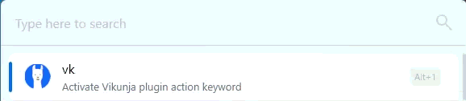

# Vikunja Flow Launcher Plugin

A Flow Launcher plugin for quickly adding tasks to Vikunja using natural language parsing.



## Features

- **Quick Add**: Use the `vk` trigger to quickly add tasks
- **Two Parsing Modes**:
  - Vikunja Quick Add Magic syntax (`*labels`, `!priority`, `+projects`)
  - Todoist-style syntax (`@labels`, `p1-p3`, `#projects`)
- **Natural Language**: Parse dates, priorities, labels, and projects from natural text
- **Configurable**: Set server URL, API token, and default project through Flow Launcher settings

## Installation

1. Launch Flow Launcher (`Alt + Space`)
2. Type `pm install Vikunja` and hit **Enter**

That's it — the plugin will be installed and ready to use instantly.

## Initial Setup

After installing the plugin, you'll need to configure it to connect to your Vikunja instance:

1. Open Flow Launcher settings
2. Navigate to the **Plugins** section
3. Find **Vikunja** in the plugin list and click on it
4. Configure the following settings:

| Setting                | Description                                                                                                                                    |
| ---------------------- | ---------------------------------------------------------------------------------------------------------------------------------------------- |
| **Server URL**         | Your Vikunja instance URL (e.g., `https://vikunja.example.com`)                                                                                |
| **API Token**          | Your Vikunja API token (see below for how to generate one)                                                                                     |
| **Default Project ID** | The project ID to use when no project is specified (visible in the URL when viewing a project, e.g. `https://vikunja.example.com/projects/4/`) |
| **Parsing Mode**       | Choose between Vikunja syntax (`*label`, `!priority`, `+project`) or Todoist syntax (`@label`, `p1`, `#project`)                               |

### Getting Your API Token

1. Log in to your Vikunja instance
2. Go to **Settings** (click your username in the top right corner)
3. Navigate to **API Tokens** in the left sidebar
4. Click **Create a new token**
5. Give it a descriptive name (e.g., "Flow Launcher Plugin")
6. Select the required permissions:
   - ✅ **Labels: create, read all** - Required to work with labels
   - ✅ **Projects: read all, read one** - Required to validate project IDs
   - ✅ **Tasks: create** - Required to add new tasks
   - ✅ **Tasks Labels: create** - Required to work with labels
7. Click **Create** and copy the generated token
8. Paste the token into the plugin settings

> ⚠️ **Warning:** Your token will be stored as plaintext in your FlowLauncher data directory.

## Usage

### Vikunja Syntax

- `vk Buy milk` - Simple task
- `vk Buy milk +Groceries` - Task with project
- `vk Buy milk *shopping !3` - Task with label and priority
- `vk Buy milk tomorrow !2 +Personal` - Task with due date, priority, and project

### Todoist Syntax

- `vk Buy milk #Groceries` - Task with project
- `vk Buy milk @shopping p1` - Task with label and priority (p1=urgent)
- `vk Buy milk tomorrow p2 #Personal` - Task with due date, priority, and project

### Date Formats

- Natural: `today`, `tomorrow`, `next monday`, `in 3 days`
- Specific: `March 15`, `3/15`, `15th`

## Development

### Project Structure

```
Flow.Launcher.Plugin.Vikunja/
├── Vikunja/
│   ├── Main.cs              # Plugin entry point
│   ├── Settings.cs          # Settings data model
│   ├── SettingsPanel.cs     # WPF settings UI
│   ├── plugin.json          # Plugin manifest
│   ├── Models/              # Data models
│   │   ├── ParsedTask.cs    # Task parsing result model
│   │   └── VikunjaModels.cs # Vikunja API models
│   └── Services/            # Business logic
│       ├── TaskParserService.cs # Natural language parser
│       └── VikunjaApiClient.cs  # HTTP API client
└── Vikunja.Tests/           # Unit tests
    └── TaskParserServiceTests.cs
```

### Prerequisites

- .NET 9.0 SDK
- Flow Launcher installed

### Building from Source

```powershell
# Build the project
dotnet build Vikunja/Vikunja.csproj -c Release

# Run tests
dotnet test Vikunja.Tests/Vikunja.Tests.csproj
```

### Installing for Development

```powershell
# Build and install in one command
dotnet build Vikunja/Vikunja.csproj -c Release

# Close Flow Launcher, install plugin, and restart
Stop-Process -Name "Flow.Launcher" -Force -ErrorAction SilentlyContinue
Start-Sleep -Seconds 2
$pluginDir = "$env:APPDATA\FlowLauncher\Plugins\Vikunja"
if (Test-Path $pluginDir) { Remove-Item -Path $pluginDir -Recurse -Force }
New-Item -ItemType Directory -Path $pluginDir -Force | Out-Null
Copy-Item -Path "Vikunja\bin\Release\net9.0-windows\*" -Destination $pluginDir -Recurse -Force
Start-Process -FilePath "$env:LOCALAPPDATA\FlowLauncher\Flow.Launcher.exe"
```

## License

MIT License - see LICENSE file for details.
